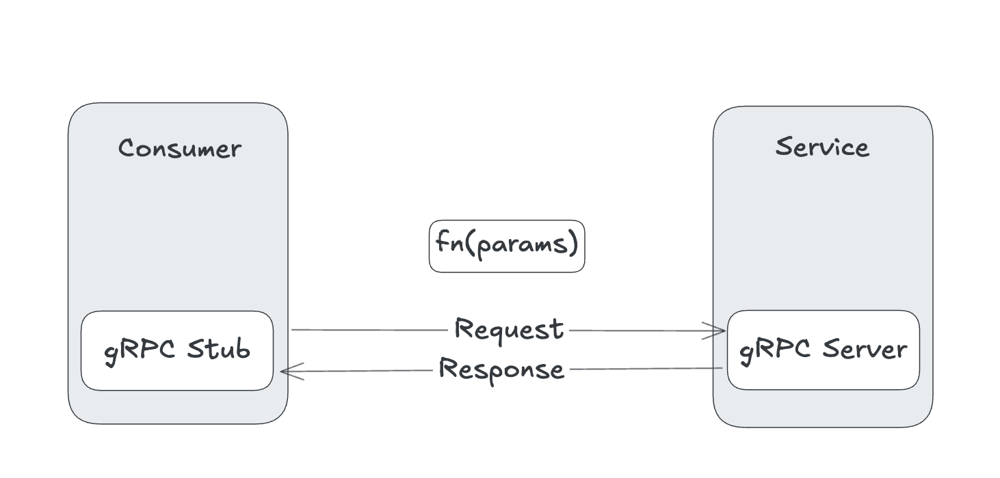

## Notes on gRPC

### Communication Patterns
With gRPC, you can leverage different inter-process communication patterns (or RPC styles) other than the simple request–response pattern.

#### Unary RPC
In simple unary RPC, when a client invokes a remote function of a server, the client sends a single request to the server
and gets a single response that is sent along with status details and trailing metadata.

